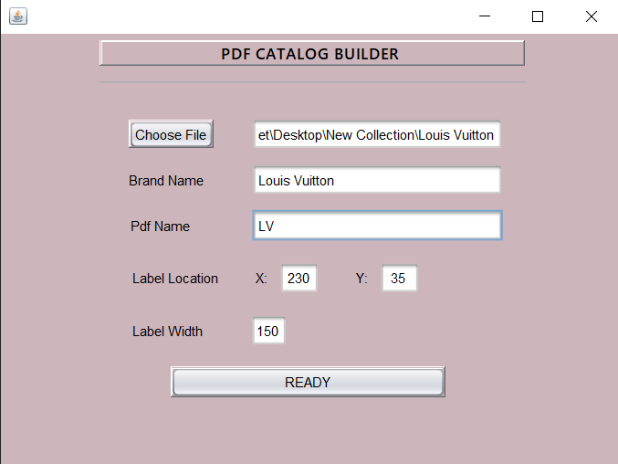
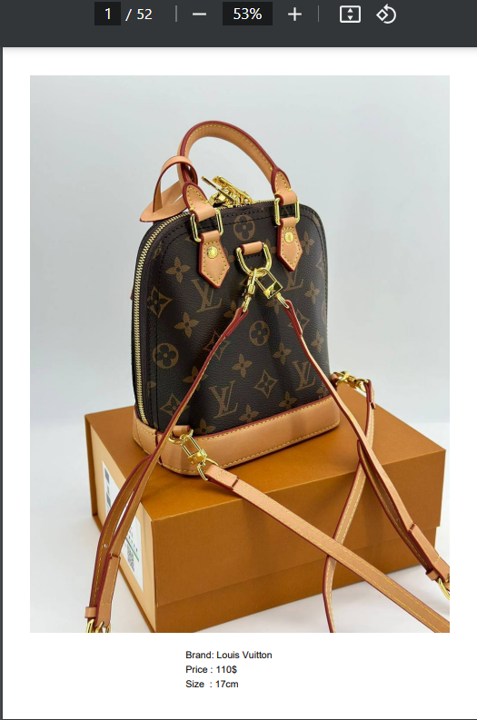
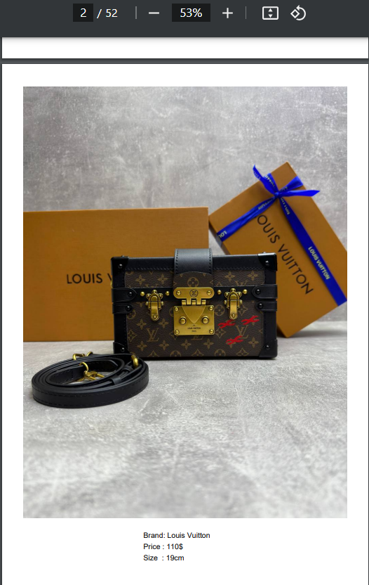

# PDF Generator Project

This project is a simple Java application that creates PDF documents with images, brand information, prices, and sizes. The generated PDF file is automatically saved in the user's Downloads folder on Windows.

## Features

- Add images to PDF documents.
- Add brand, price, and size labels to each page.
- Customize label positions and dimensions.
- Automatically save the PDF file to the user's Downloads folder.

## Screenshots

Here are some screenshots of the program in action:






  
## Prerequisites

- Java Development Kit (JDK) 8 or higher.
- iText8 library (for PDF creation).

## Getting Started

### Installing the iText8 Library

To use this project, you need to include the iText8 library. If you are using Maven, add the following dependency to your `pom.xml` file:

```xml
<dependency>
    <groupId>com.itextpdf</groupId>
    <artifactId>itext8-core</artifactId>
    <version>8.0.2</version>
    <type>pom</type>
</dependency>
```
Alternatively, download the iText8 JAR files and include them in your project classpath.

### Running the Project

1-Clone the repository or download the project files:
git clone https://github.com/yourusername/pdf-generator.git

2-Open the project in your IDE (e.g., Apache NetBeans, IntelliJ IDEA).

3-Make sure the iText8 library is included in the project's classpath.

4-Compile and run the UI class.

### Example Usage

Here is an example of how to use the createPdf method:
```java
public class Main {
    public static void main(String[] args) throws IOException {
        // Paths to the images to be added to the PDF
        List<String> imagePaths = Arrays.asList("path_to_image1.jpg", "path_to_image2.jpg");

        // Brand, prices, and sizes for the products
        String brand = "YourBrand";
        List<String> prices = Arrays.asList("$10.99", "$15.49");
        List<String> sizes = Arrays.asList("M", "L");

        // Define the label position and width
        int xLocation = 50;
        int yLocation = 750;
        int labelWidth = 150;

        // Create the PDF and save it to the Downloads folder
        PdfCreator.createPdf("C:/Users/YourUsername/Downloads/output.pdf", imagePaths, brand, prices, sizes, xLocation, yLocation, labelWidth);

        System.out.println("PDF created successfully.");
    }
}
```
### Customizing the PDF
You can modify the following parameters in the createPdf method to adjust how the PDF is generated:

- imagePaths: A list of file paths for the images you want to add.
- brand: The brand name to display on each page.
- prices: A list of prices corresponding to each image.
- sizes: A list of sizes corresponding to each image.
- x_location and y_location: The coordinates for placing the labels.
- label_width: The width of the label area on the page.

### Saving to a Custom Location

By default, the PDF is saved to the user's Downloads folder. You can change the destination path by modifying the dest argument in the createPdf method:
```java
String dest = "C:/Users/YourUsername/Desktop/custom_output.pdf";
```


